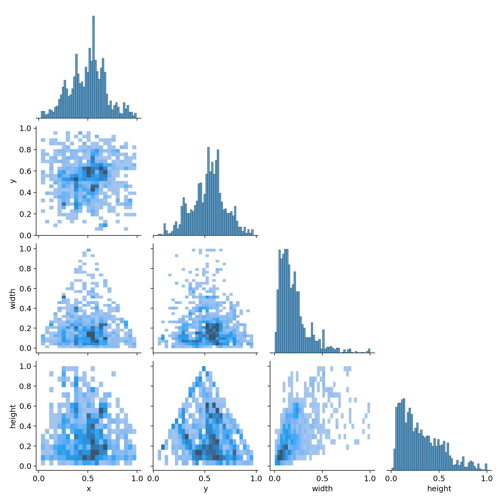

# 🔥 Fire Detection System using YOLOv8 and Raspberry Pi

## 🚀 Project Overview

This project implements a real-time fire detection system using the **YOLOv8 (You Only Look Once, version 8)** object detection model. It is optimized for deployment on **Raspberry Pi 3B+** and includes alerting features such as a **buzzer** and **emergency SMS notifications** using the **Twilio API**.

## 🎯 Features

- ✅ Real-time fire detection using YOLOv8  
- 🔔 Buzzer alert for immediate local warning  
- 📱 SMS alert to fire department or user via GSM module and Twilio  
- 🧠 Trained on a custom dataset for high accuracy  
- 💻 Runs efficiently on Raspberry Pi (edge device)  

---

## 🧠 Model Details

- **Model**: YOLOv8 (from [Ultralytics](https://github.com/ultralytics/ultralytics))  
- **Architecture**: One-stage object detector with CSPDarkNet backbone  
- **Input Size**: Configurable (default: 640×640)  
- **Dataset**: Custom-labeled dataset with fire and non-fire images in YOLO format  
- **Training Platform**: Google Colab with GPU  
- **Deployment**: Raspberry Pi 3B+ using the PyTorch version of YOLOv8  

---

## 🧰 Hardware Requirements

- Raspberry Pi 3B+  
- Pi Camera Module  
- Buzzer (3.3V or 5V passive buzzer)  
- GSM module (optional)  
- Internet connection (for Twilio API usage)  

---

## 💻 Software & Dependencies

### Python Libraries

```bash
pip install ultralytics opencv-python twilio numpy
```

#### If running on Raspberry Pi:

- Install OpenCV:
  ```bash
  sudo apt update
  sudo apt install python3-opencv
  ```

### Other Tools:
- RPi.GPIO or GPIO Zero (for buzzer)
- Twilio account and API credentials for SMS alerts

---

## 📁 Dataset

- Custom-labeled fire detection dataset  
- Labeled using Roboflow or CVAT in YOLO format  
- Suggested public datasets:
  - [Fire & Smoke Dataset - Roboflow](https://universe.roboflow.com/)
  - [FiresNet](https://github.com/FiresNet)

---

## 🏋️‍♂️ Training the Model

1. Prepare your dataset in YOLO format (`images/train`, `labels/train`, etc.)  
2. Use Google Colab with GPU for faster training:
   ```python
   from ultralytics import YOLO

   model = YOLO('yolov8n.pt')  # Or 'yolov8s.pt' for better accuracy
   model.train(data='data.yaml', epochs=100, imgsz=640)
   ```

3. Save the best model (`best.pt`) and export it

---

## 🎥 Real-Time Inference

```python
from ultralytics import YOLO
import cv2

model = YOLO('best.pt')  # Path to trained model

# Start webcam stream
model.predict(source=0, show=True, conf=0.5)
```

---

## 🔔 Buzzer & SMS Alert Integration (On Raspberry Pi)

Use GPIO to trigger a buzzer when fire is detected:

```python
import RPi.GPIO as GPIO
import time
from twilio.rest import Client

buzzer_pin = 18
GPIO.setmode(GPIO.BCM)
GPIO.setup(buzzer_pin, GPIO.OUT)

def alert():
    GPIO.output(buzzer_pin, GPIO.HIGH)
    time.sleep(2)
    GPIO.output(buzzer_pin, GPIO.LOW)
    
    # Send SMS via Twilio
    client = Client("TWILIO_SID", "TWILIO_AUTH_TOKEN")
    client.messages.create(
        to="+91xxxxxxxxxx",
        from_="+1YourTwilioNumber",
        body="Fire detected!"
    )
```

---

## 📊 Results

- Detection Accuracy: ~90%  
- Real-time inference speed: ~10–15 FPS on Pi Camera  
- Output: Live video feed with bounding box and class label ("fire")

---

## 📊 Result Images

<p align="center">
  
  <br>
  <em> *Figure 1: YOLOv8 training performance curves — loss metrics (box, class, DFL) and evaluation metrics (precision, recall, mAP50, mAP50-95) across 100 epochs.* </em>
</p>

<p align="center">
  
  <br>
  <em> Figure 2: Distribution and correlation heatmap of bounding box labels — showing normalized x, y, width, and height values from the fire detection dataset. </em>
</p>

<p align="center">
  
  
</p>

<p align="center">
  <em>Figure 3: Results </em>
</p>

---

## 📌 Future Scope

- Add smoke detection for early fire detection  
- Integrate temperature and gas sensors  
- Deploy on Jetson Nano / Coral Edge TPU for faster inference  
- Add cloud-based alert dashboard or email support  

---

## 📚 References

- [Ultralytics YOLOv8 Docs](https://docs.ultralytics.com/)  
- [Twilio Python API](https://www.twilio.com/docs/quickstart/python/sms#overview)  
- [OpenCV Python Docs](https://docs.opencv.org/)  
- [Raspberry Pi GPIO Guide](https://gpiozero.readthedocs.io/)  
- [Roboflow Fire Dataset](https://universe.roboflow.com/)  

---

## 📜 License

This project is licensed under the MIT License – see the [LICENSE](LICENSE) file for details.
